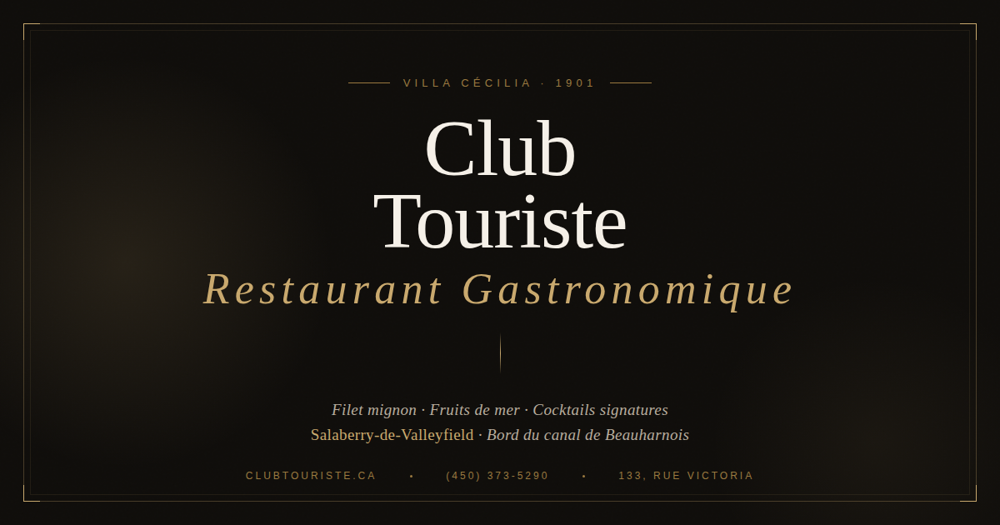

<p align="center">
  
</p>

<h1 align="center">Club Touriste</h1>

<p align="center">
  <strong>Restaurant gastronomique — Salaberry-de-Valleyfield, Québec</strong><br>
  <em>Villa Cécilia · Depuis 1930 · Au bord du canal de Beauharnois</em>
</p>

<p align="center">
  <a href="https://clubtouriste.ca">clubtouriste.ca</a> ·
  <a href="https://www.facebook.com/clubtouriste">Facebook</a> ·
  <a href="https://www.instagram.com/clubtouriste">Instagram</a> ·
  <a href="https://www.tiktok.com/@clubtouriste">TikTok</a>
</p>

<p align="center">
  
  
  
  
  
</p>

---

## À propos

Site Web officiel du **Club Touriste**, restaurant gastronomique situé dans la Villa Cécilia — une maison victorienne de 1901 au bord du canal de Beauharnois à Salaberry-de-Valleyfield, Québec.

Le site est entièrement statique (HTML/CSS/JS), sans framework ni CMS, optimisé pour la performance, le SEO local et la conformité à la **Loi 25** du Québec sur la protection des renseignements personnels.

## Architecture

```
clubtouriste.ca/
├── index.html                              # Page d'accueil
├── js/
│   └── cookieconsent-config.js             # Bannière consentement (Loi 25)
├── menu/
│   ├── index.html                          # Menu complet (PWA)
│   ├── manifest.webmanifest
│   └── sw.js
├── midi/
│   ├── index.html                          # Menu du midi (PWA)
│   ├── manifest.webmanifest
│   └── sw.js
├── politique-de-confidentialite/
│   └── index.html                          # Politique de confidentialité
├── vercel.json                             # Config Vercel (redirects, headers)
├── og-image.png                            # Open Graph — accueil
├── og-menu.png                             # Open Graph — menu
├── og-midi.png                             # Open Graph — midi
├── favicon.ico
├── apple-touch-icon.png
├── favicon-32x32.png
├── favicon-16x16.png
├── site.webmanifest
└── robots.txt
```

## Stack technique

| Composant | Technologie |
|---|---|
| **Frontend** | HTML/CSS/JS vanilla — aucun framework |
| **Fonts** | Playfair Display, Cormorant Garamond, Jost (Google Fonts) |
| **Hébergement** | Vercel |
| **Analytics** | Google Analytics 4 (GA4) avec Consent Mode v2 |
| **Consentement cookies** | [CookieConsent v3](https://github.com/orestbida/cookieconsent) (open source, self-hosted) |
| **Réservations** | LiboService / LibroReserve |
| **PWA** | Service Workers pour Menu et Menu Midi (offline-capable) |
| **SEO** | Schema.org (Restaurant, Menu, FAQ, BreadcrumbList) |

## Fonctionnalités

### Pages
- **Accueil** — Histoire, aperçu du menu, section événements/corporatif, coordonnées et heures
- **Menu** — Carte complète : entrées, viandes, poissons, plats principaux, vins, cocktails, spiritueux
- **Menu Midi** — Formule lunch en semaine
- **Politique de confidentialité** — Conforme Loi 25

### PWA (Progressive Web App)
Les pages Menu et Menu Midi sont installables sur mobile comme applications natives. Le service worker met en cache les ressources pour un accès hors-ligne — idéal pour les clients qui consultent le menu en salle sans connexion.

### SEO local
- Schema.org `Restaurant` avec géolocalisation, heures d'ouverture, menu items
- Schema.org `Menu` avec sections et prix
- Schema.org `FAQPage` pour les questions fréquentes
- Open Graph et Twitter Cards optimisés par page
- Balises geo-targeting (geo.region, geo.position, ICBM)
- Canonical URLs

### Conformité Loi 25
- Bannière de consentement en français (opt-in strict)
- Google Analytics 4 bloqué par défaut — ne se charge qu'après consentement explicite
- Google Consent Mode v2 intégré
- Boutons « Accepter » et « Refuser » de poids égal
- Lien « Gérer les témoins » dans le footer de chaque page
- Politique de confidentialité complète avec droits des utilisateurs
- Responsable désigné : `security@bunkers.co`

## Développement local

```bash
# Cloner le repo
git clone https://github.com/VOTRE-ORG/clubtouriste.ca.git
cd clubtouriste.ca

# Servir localement (n'importe quel serveur statique)
npx serve .
# ou
python3 -m http.server 8000
```

Ouvrir `http://localhost:8000` (ou le port indiqué).

> **Note :** Le consentement cookies et GA4 fonctionnent uniquement en HTTPS ou sur `localhost`. En développement local, la bannière s'affichera mais GA4 ne transmettra pas de données.

## Déploiement

Le site se déploie automatiquement sur **Vercel** à chaque push sur la branche `main`.

```bash
# Vérifier le build localement
vercel dev

# Déployer en preview
vercel

# Déployer en production
vercel --prod
```

### Variables d'environnement

Aucune variable d'environnement requise. Le site est entièrement statique.

### Domaine

Le domaine `clubtouriste.ca` est configuré dans Vercel avec :
- Redirection `www.clubtouriste.ca` → `clubtouriste.ca`
- HTTPS automatique (Let's Encrypt)

## Mise à jour du contenu

### Modifier le menu
Éditer directement le HTML dans `menu/index.html`. Les items suivent cette structure :
```html
<div class="menu-item">
  <div>
    <div class="item-header">
      <span class="item-name">Nom du plat</span>
      <span class="badge-gf">Sans gluten</span>  <!-- optionnel -->
    </div>
    <div class="item-desc">Description des ingrédients</div>
  </div>
  <div class="item-price">59</div>
</div>
```

### Modifier les heures d'ouverture
Mettre à jour dans `index.html` :
1. Le tableau HTML dans la section `#contact`
2. Le Schema.org `openingHoursSpecification` dans le `<head>`

### Modifier les promos
Le bandeau d'annonce (announcement bar) en haut du site peut être activé/désactivé dans `index.html`.

## Performance

Le site est conçu pour des scores Lighthouse maximaux :

| Métrique | Cible |
|---|---|
| Performance | 95+ |
| Accessibilité | 95+ |
| Bonnes pratiques | 100 |
| SEO | 100 |

Aucun JavaScript bloquant le rendu. CSS inline. Fonts préconnectées. Images optimisées.

## Conformité légale

| Exigence | Statut |
|---|---|
| Loi 25 — Bannière de consentement | ✅ |
| Loi 25 — Politique de confidentialité | ✅ |
| Loi 25 — Responsable désigné | ✅ |
| Loi 25 — Opt-in strict (cookies bloqués par défaut) | ✅ |
| Loi 25 — Droit de retrait du consentement | ✅ |
| Loi 25 — Droits d'accès, rectification, suppression | ✅ |
| Google Consent Mode v2 | ✅ |

## Contact

**Club Touriste**
133, Rue Victoria
Salaberry-de-Valleyfield, QC J6T 1A3

📞 [(450) 373-5290](tel:+14503735290)
📧 resto@clubtouriste.ca
🔒 Vie privée : [security@bunkers.co](mailto:security@bunkers.co)

---

<p align="center">
  <em>Villa Cécilia · 1901</em><br>
  <strong>Gastronomie & Histoire à Valleyfield</strong>
</p>
